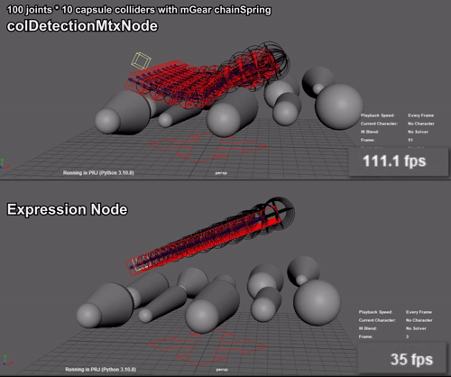

# colDetectionNode

Custom-node of collision detection part (expression node) of [maya_expressionCollision](https://github.com/akasaki1211/maya_expressionCollision).  
Processing speed can be expected to improve.  

> **Warning**  
> Internal Use ID (0x7c001, 0x7c002) is used.

## Nodes  
There are two types of nodes of: input as vectors (`colDetectionNode`) or input as matrices (`colDetectionMtxNode`). These outputs are the same.
  

|use `colDetectionNode`|use `colDetectionMtxNode`|
|---|---|
|||

## Specification
||`colDetectionNode`|`colDetectionMtxNode`|expression node ([maya_expressionCollision](https://github.com/akasaki1211/maya_expressionCollision))|
|---|---|---|---|
|**Supported Collider**|- sphere - capsule - capsule2 - infinite plane|- sphere - capsule - capsule2 - infinite plane|- sphere - capsule - capsule2 - infinite plane - cuboid|
|**Parent**|required|required|optional|
|**Ground Collision**|✔|✔|✔|
|**Scalable**|-|✔|✔|

## Pre-built plug-ins
Pre-built `colDetectionNode.mll` in the [plug-ins](./plug-ins) folder. Install to the appropriate Maya version and ready to use.  
|Build|Plug-in (*Click on "Download raw file" at the link.)|
|---|---|
|Maya 2022 Update 5 win64|[download](./plug-ins/2022/colDetectionNode.mll)|
|Maya 2023 Update 3 win64|[download](./plug-ins/2023/colDetectionNode.mll)|
|Maya 2024 Update 2 win64|[download](./plug-ins/2024/colDetectionNode.mll)|

## Performance
The following is the processing time for a single node when one each of sphere, capsule, and infinitePlane Collider is used, Iterations : 3, GroundCol : On.  
On its own, `colDetectionNode` is faster, but `colDetectionMtxNode` may be faster as a result because it does not require decomposeMatrix, etc. 　

|`colDetectionNode`|`colDetectionMtxNode`|expression node ([maya_expressionCollision](https://github.com/akasaki1211/maya_expressionCollision))|
|---|---|---|
|14.48us|26.12us|78.33us|

The following image shows a processing time comparison of 100 nodes when 10 capsule2 colliders are used, Iterations: 3, and GroundCol: On.

> **Tested:**  
> * Windows 11
> * Intel(R) Core(TM) i7-10700 CPU @ 2.90GHz
> * 32GB RAM
> * NVIDIA GeForce RTX 3060

## Note  
* Processing order of collider type cannot be changed.  
* Too many colliders reduce accuracy.  
